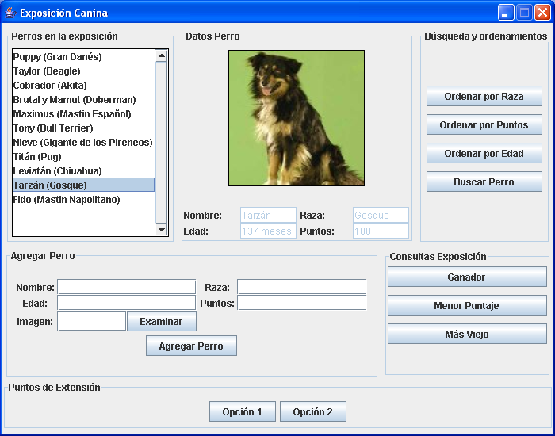

# Exposición Canina

## Enunciado

En una exposición canina se realizan desfiles de ejemplares de diferentes razas.
De cada ejemplar se manejan la siguiente información: nombre (el cual debe ser único
en toda la exposición), raza, edad y puntos otorgados en la exposición.

El cliente necesita una aplicación que permita manipular la información de los
participantes de los desfiles caninos. Además de la información básica, se tiene
también la foto de cada perro.

La aplicación debe:

1. Mostrar la lista de los perros registrados en la exposición, ordenada por raza, puntos o edad.

2. Mostrar la información de un perro específico.

3. Registrar un nuevo perro.

4. Localizar un perro por su nombre.

5. Buscar el perro ganador de la exposición (el que tiene un mayor puntaje asignado).

6. Buscar el perro con el menor puntaje.

7. Buscar el perro más viejo de todos (con mayor edad).

La información inicial de los perros se obtiene de un archivo de propiedades.
Al ejecutar el programa, se carga esta información.

## Interfaz

